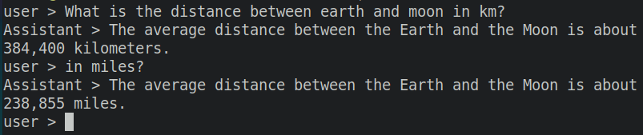

# duckchat
Go based client for DuckChat

## Example 1:
```bash
go run cmd/cli.go
```


## Example 2:
```go
package main

import (
	"fmt"

	"github.com/mohanavel15/duckchat"
)

func main() {
	agent := duckchat.NewAgent(duckchat.GPT3dot5Turbo)

	response, err := agent.Send("What is Sagittarius A-Star?")
	if err != nil {
		fmt.Println("Unexpected Error:", err.Error())
		return
	}

	fmt.Println("Assistant:", response)
}
```